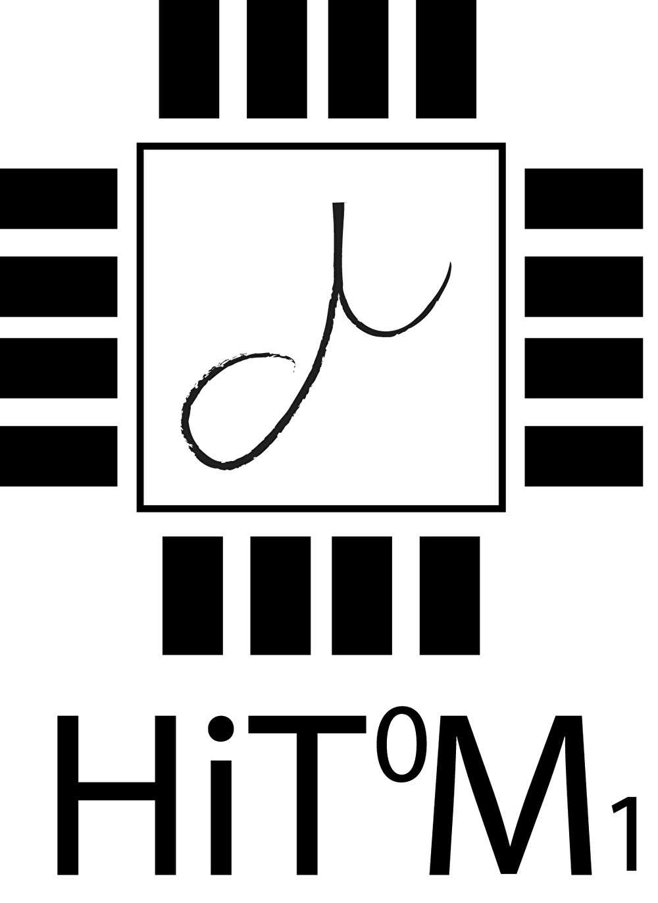
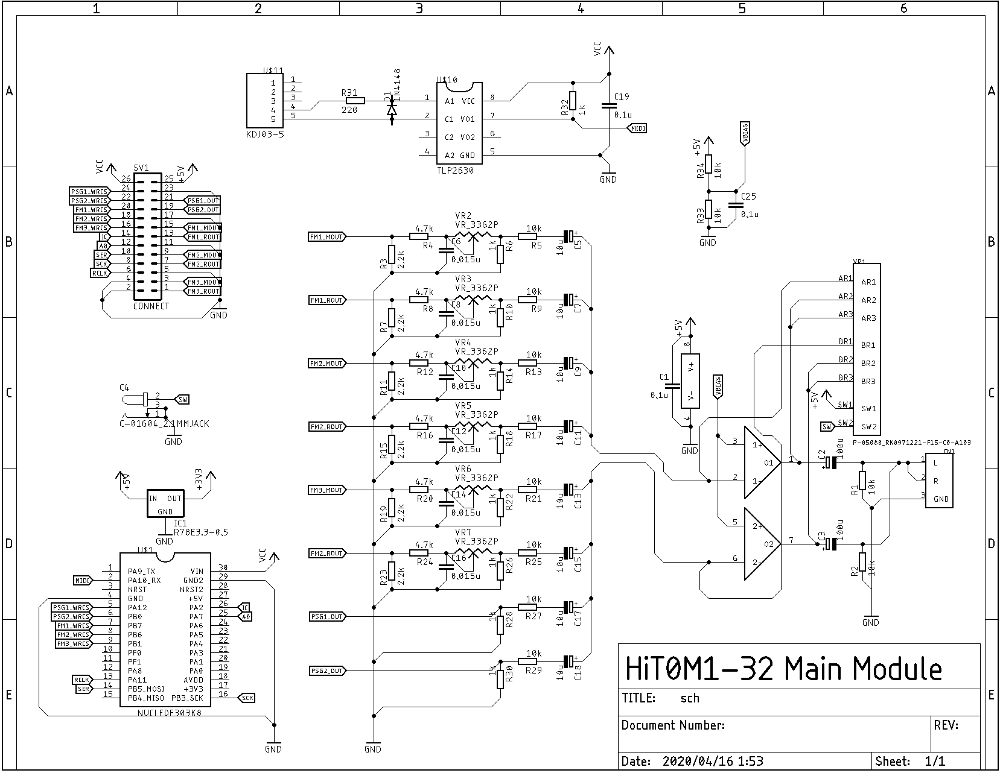
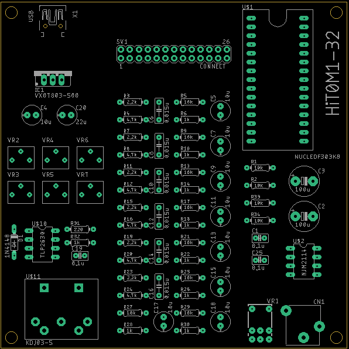
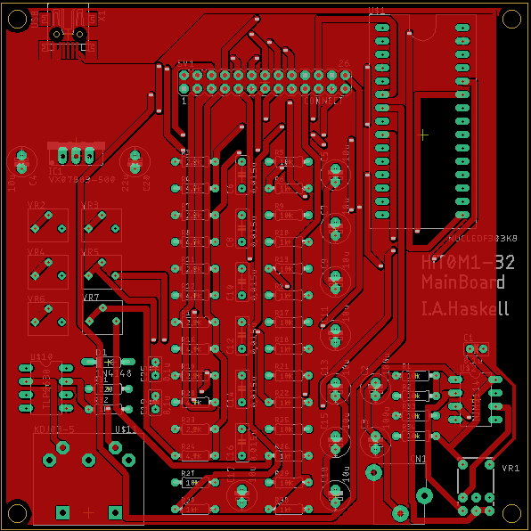
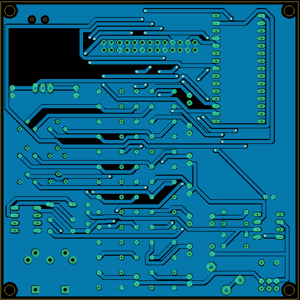
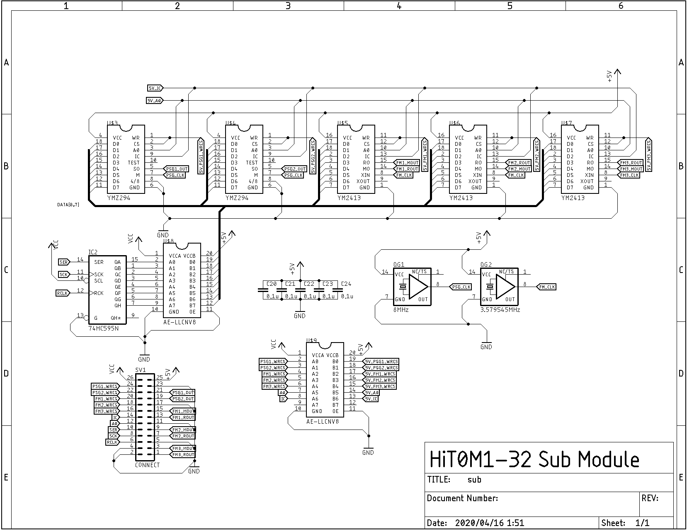
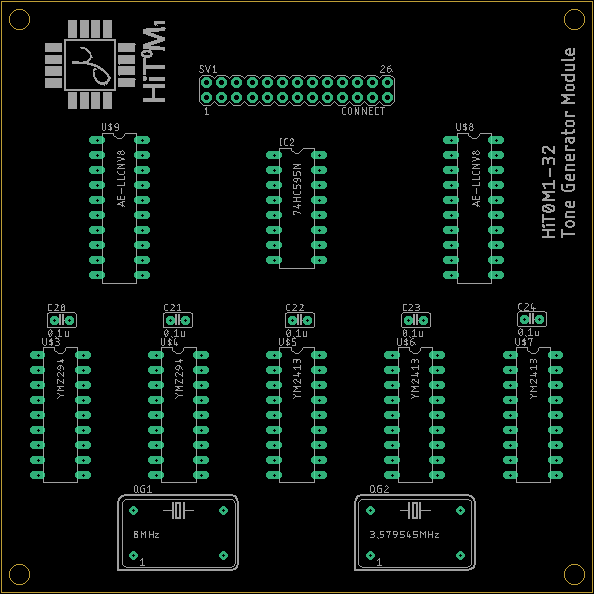
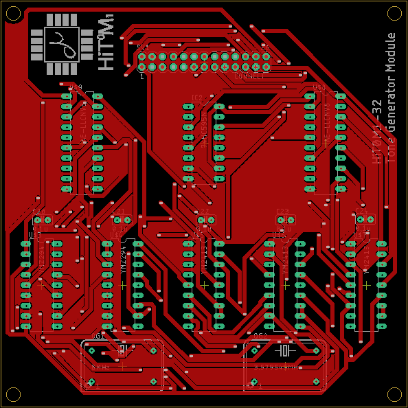
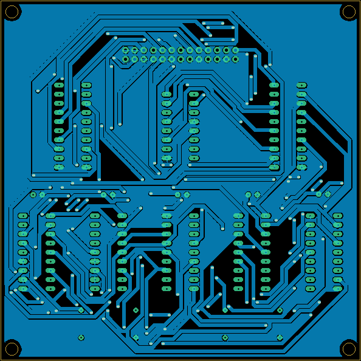

# HiT0M1-32

Hardware MIDI Tone Generator Machine - 32

***THIS PROJECT IS W.I.P!!!!***

## 仕様

メインMCU:**STM32F303K8 UpTo 72MHz**

PSG音源IC:**YMZ294**

FM音源IC:**YM2413**

最大同時発音数:**PSG6和音,FMメロディー24ch,FMリズム5ch**

入力:**MIDI**

I/F:**USB(UART@9600bps),MIDI(DIN5Pin),3.5mmステレオジャック(出力はモノラル)**

インジケータ:**LEDx1(MIDI IN)**

基板:**100x100,2層**

## ハードウェアについて

回路図を以下に示す。

### Main Board(HiTOMI-32)

### Sub Board(Hikaru)

## ソフトウェア

### 実装した機能

- 30音(メロディー)同時発音可能

- GM1相当の音色マップの一部
- コントロールチェンジ
  - エクスプレッション
  - ボリュームコントロール
- ノートオンイベント
- ノートオフイベント