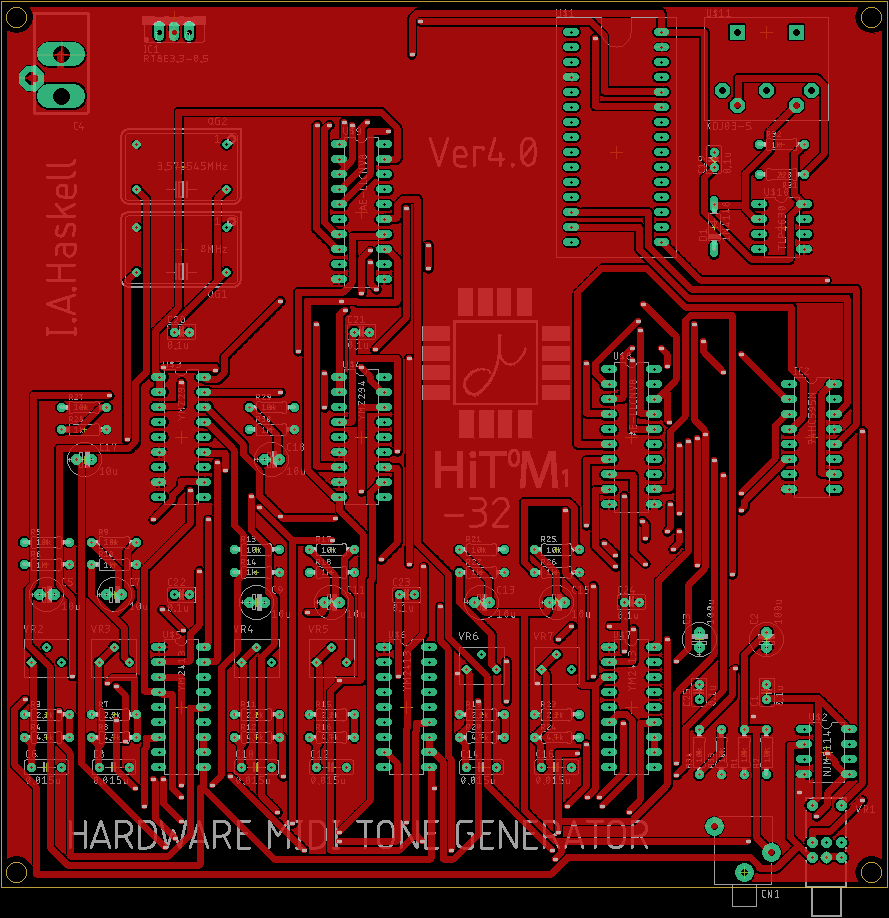
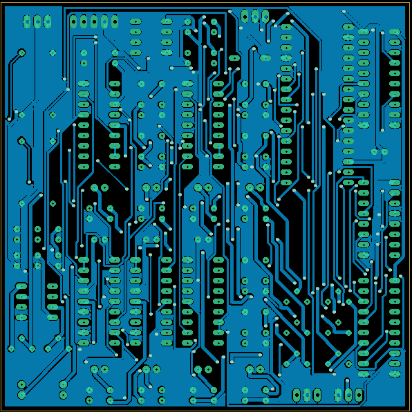
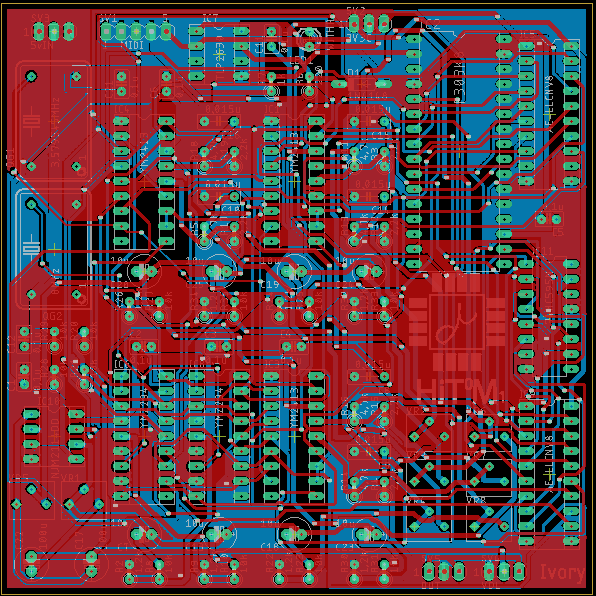
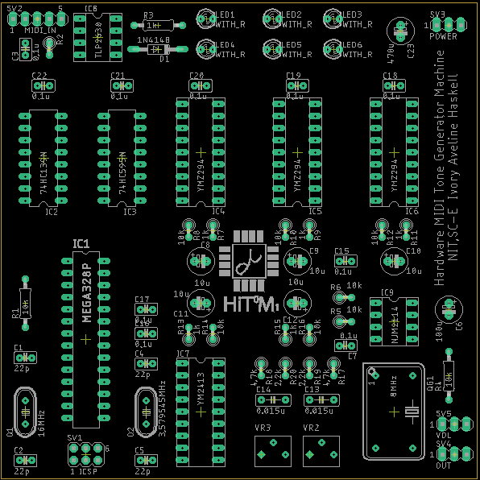

# HiT0M1

***THIS PROJECT IS W.I.P!!!!***

## 仕様

メインMCU:**ATMega328p@16MHz**

PSG音源IC:**YMZ294**

FM音源IC:**YM2413**

最大同時発音数:**PSG9和音,FMメロディー6ch,FMリズム5ch**

入力:**MIDI**

I/F:**MIDI(DIN5Pin),3.5mmステレオジャック(出力はモノラル)**

インジケータ:**LEDx6(MIDI IN,発音状況x5)**

基板:**100x100,2層**

## ハードウェアについて

回路図を以下に示す。

### 使用している部品

なお一部の部品は入手が難しい場合がある。

ここでいう"個数"は購入数であり、実際に使う数とは異なることを前置きしておく。

**IC類**

| 名称                                                         | 個数 | 小計 |
| ------------------------------------------------------------ | ---- | ---- |
| [ＡＶＲマイコンＡＴＭＥＧＡ１２８４Ｐ－ＰＵ](http://akizukidenshi.com/catalog/g/gI-04461/) | 1    | 750  |
| [ヤマハ音源ＩＣ（ＹＭＺ２９４）](http://akizukidenshi.com/catalog/g/gI-12141/) | 3    | 900  |
| [YM2413](https://www.chip1stop.com/view/dispDetail/DispDetail?partId=YMHA-0000015&mpn=YM2413) | 1    | 1660 |
| [２回路入ＨｉＦｉオペアンプ　ＮＪＭ２１１４ＤＤ](http://akizukidenshi.com/catalog/g/gI-00068/) | 1    | 100  |
| [フォトカプラ　フォトリレー　ＴＬＰ２６３０Ｆ](http://akizukidenshi.com/catalog/g/gI-08254/) | 1    | 150  |

**抵抗**

| 抵抗値                                                       | 個数 | 小計 |
| ------------------------------------------------------------ | ---- | ---- |
| [カーボン抵抗（炭素皮膜抵抗）　１／４Ｗ２２０Ω　（１００本入）](http://akizukidenshi.com/catalog/g/gR-25221/) | 1    | 100  |
| [カーボン抵抗（炭素皮膜抵抗）　１／４Ｗ１ｋΩ　（１００本入）](http://akizukidenshi.com/catalog/g/gR-25102/) | 1    | 100  |
| [カーボン抵抗（炭素皮膜抵抗）　１／４Ｗ２．２ｋΩ　（１００本入）](http://akizukidenshi.com/catalog/g/gR-25222/) | 1    | 100  |
| [カーボン抵抗（炭素皮膜抵抗）　１／４Ｗ４．７ｋΩ　（１００本入）](http://akizukidenshi.com/catalog/g/gR-25472/) | 1    | 100  |
| [カーボン抵抗（炭素皮膜抵抗）　１／４Ｗ１０ｋΩ　（１００本入）](http://akizukidenshi.com/catalog/g/gR-25103/) | 1    | 100  |
| [半固定ボリューム　３３６２Ｐ　１０ｋΩ　［１０３］](http://akizukidenshi.com/catalog/g/gP-03277/) | 2    | 80   |

**コンデンサ**

| 容量                                                         | 個数 | 小計 |
| ------------------------------------------------------------ | ---- | ---- |
| [セラミックコンデンサー　２２ｐＦ２ｋＶ](http://akizukidenshi.com/catalog/g/gP-11548/) | 2    | 20   |
| [絶縁ラジアルリード型積層セラミックコンデンサー　０．１μＦ５０Ｖ２．５４ｍｍ　（１０個入）](http://akizukidenshi.com/catalog/g/gP-00090/) | 9    | 100  |
| [フィルムコンデンサー　０．０１５μＦ５０Ｖ　ルビコンＦ２Ｄ](http://akizukidenshi.com/catalog/g/gP-15048/) | 2    | 20   |
| [オーディオ用電解コンデンサー１０μＦ５０Ｖ８５℃　ニチコンＦＧ](http://akizukidenshi.com/catalog/g/gP-04621/) | 5    | 50   |
| [オーディオ用電解コンデンサー１００μＦ２５Ｖ８５℃　ニチコンＦＧ](http://akizukidenshi.com/catalog/g/gP-05041/) | 1    | 20   |
| [電源用電解コンデンサー４７０μＦ３５Ｖ１０５℃　ルビコンＺＬＨ](http://akizukidenshi.com/catalog/g/gP-02719/) | 1    | 40   |

**クリスタル**

| 名称                                                         | 個数 | 小計 |
| ------------------------------------------------------------ | ---- | ---- |
| [クリスタル（水晶発振子）　１６ＭＨｚ](http://akizukidenshi.com/catalog/g/gP-08671/) | 1    | 30   |
| [クリスタル（水晶発振子）　３．５７９５４５ＭＨｚ](http://akizukidenshi.com/catalog/g/gP-08664/) | 1    | 30   |
| [クリスタルオシレータ　８ＭＨｚ（長方形）](http://akizukidenshi.com/catalog/g/gP-01566/) | 1    | 100  |

その他

| 名称                                                         | 個数 | 小計 |
| ------------------------------------------------------------ | ---- | ---- |
| [抵抗内蔵５ｍｍ赤色ＬＥＤ（５Ｖ用）　ＯＳＲ６ＬＵ５Ｂ６４Ａ－５Ｖ](http://akizukidenshi.com/catalog/g/gI-12517/) | 6    | 90   |
| [ＤＩＮソケット（メス）　５Ｐ　１８０°　ＭＪ－１９２](http://akizukidenshi.com/catalog/g/gC-10456/) | 1    | 60   |
| [２．１ｍｍ標準ＤＣジャック　パネル取付用　ＭＪ－４０](http://akizukidenshi.com/catalog/g/gC-08629/) | 1    | 85   |
| [超小型スイッチングＡＣアダプター５Ｖ１Ａ　ＡＤ－Ｄ５０Ｐ１００](http://akizukidenshi.com/catalog/g/gM-06096/) | 1    | 600  |
| [小型ボリューム　１０ＫΩＡ（１６Ｋ４）](http://akizukidenshi.com/catalog/g/gP-00242/) | 1    | 40   |
| [汎用小信号高速スイッチング・ダイオード　１Ｎ４１４８　１００Ｖ２００ｍＡ（５０本入）](http://akizukidenshi.com/catalog/g/gI-00941/) | 1    | 100  |
| [ボックスヘッダ　６Ｐ（２×３）](http://akizukidenshi.com/catalog/g/gC-13175/) | 1    | 15   |
| [丸ピンＩＣソケット　（　８Ｐ）](http://akizukidenshi.com/catalog/g/gP-00035/) | 2    | 30   |
| [丸ピンＩＣソケット　（１６Ｐ）](http://akizukidenshi.com/catalog/g/gP-00029/) | 2    | 60   |
| [丸ピンＩＣソケット　（１８Ｐ）](http://akizukidenshi.com/catalog/g/gP-00030/) | 4    | 160  |
| [丸ピンＩＣソケット　（２８Ｐ）　３００ｍｉｌ](http://akizukidenshi.com/catalog/g/gP-01339/) | 1    | 70   |
| [金属ケース　アルミ製　ＭＢ１２－３－１２](http://akizukidenshi.com/catalog/g/gP-13712/)(オプショナル) | 1    | 750  |
| [基板用ワンタッチスペーサー　両面テープ付](http://akizukidenshi.com/catalog/g/gP-12347/)(オプショナル) | 8    | 160  |
| [３．５ｍｍステレオミニジャックＭＪ－０７４Ｎ　パネル取付用](http://akizukidenshi.com/catalog/g/gC-09630/) | 1    | 65   |
| [３Ｐトグルスイッチ　１回路２接点](http://akizukidenshi.com/catalog/g/gP-03774/) | 1    | 80   |
| [メタルツマミ（ノブ）　Ｋ－２９－６．１　Φ１３．７×１３．５ｍｍ　アルミ削り出し](http://akizukidenshi.com/catalog/g/gP-12202/) | 1    | 310  |
| [耐熱電子ワイヤー　１ｍ×１０色　導体外径０．７５ｍｍ（ＡＷＧ２２相当）](http://akizukidenshi.com/catalog/g/gP-11641/) | 1    | 300  |
| 基板(10枚)                                                   | 1    | 2500 |
| 秋月の送料                                                   | 1    | 500  |

**合計:10545円(ケースあり、工具なし)**

ケースなし、基板の費用を考えない場合:7135円

配線材などを自分で持っていれば更に安くなる。

(2台目以降:6545円)

### 工具

| 名称                                                         | 単価 |
| ------------------------------------------------------------ | ---- |
| [六角棒レンチ 1.5mm](https://www.monotaro.com/p/2995/8872/)  | 30   |
| [電気ドリル](https://www.monotaro.com/g/04120647/?monotaroNo=28556344) | 3690 |
| [ストレートドリルセット TiNコート](https://www.monotaro.com/g/02896015/?monotaroNo=68712053) | 1790 |
| [テーパリーマ](https://www.monotaro.com/p/3552/2094/)        | 899  |
| [チタンコートダイヤモンドヤスリセット](https://www.monotaro.com/p/3105/7259/) | 499  |

**工具分合計:6908円**

**フルセットで揃えた場合:17453円**

## ソフトウェア

### MIDIメッセージに対する動作

| 16進数データ                                                 | MIDIメッセージ       | 動作                                    |
| ------------------------------------------------------------ | -------------------- | --------------------------------------- |
| 0x80 \| チャンネル(0-4,9), ノート番号, ベロシティ, | ノートオフ           | 該当する音を止める(PSG1-3,FM_M,FM_R)    |
| 0x90 \| チャンネル(0-4,9), ノート番号, ベロシティ  | ノートオン           | 該当する音を出す(PSG1-3,FM_M,FM_R)      |
| 0xB0 \| チャンネル(0-4), コントロール番号(0-119), データ値(0-127) | コントロールチェンジ | 後述                                    |
| 0xC0 \| 0x03, プログラム番号(後述)                      | プログラムチェンジ   | FM音源の音色の切り替え(チャンネル3のみ) |
| 0xB0 \| チャンネル(0-4,9), 0x7B, 0x00              | オールノートオフ     | 該当チャンネルの音を停止                |
| その他                                                       | ---                  | すべて無視                              |

**コントロールチェンジについて**

**プログラムチェンジについて**

FM音源チップの内蔵音源の中から選択する。

プログラム番号は以下の通り。

この番号はGeneral MIDIに従っている。

| プログラム番号 | 音色                              |
| -------------- | --------------------------------- |
| 0xFF           | オリジナル音色(未定義),通常不使用 |
| 0x28           | ヴァイオリン                      |
| 0x18           | ギター                            |
| 0x00           | ピアノ                            |
| 0x49           | フルート                          |
| 0x47           | クラリネット                      |
| 0x44           | オーボエ                          |
| 0x38           | トランペット                      |
| 0x14           | オルガン                          |
| 0x3C           | ホルン                            |
| 0x50           | シンセ                            |
| 0x06           | ハープシコード                    |
| 0x0B           | ビブラフォン                      |
| 0x26           | シンセベース                      |
| 0x24           | ウッドベース                      |
| 0x1B           | エレキギター                      |

**リズム音源について**

ノート番号と実際の音の表を以下に示す。

| ノート番号 | 音色           |
| ---------- | -------------- |
| 0x24       | バスドラム     |
| 0x26       | スネアドラム   |
| 0x2F       | タムタム       |
| 0x31       | トップシンバル |
| 0x2A       | ハイハット     |

