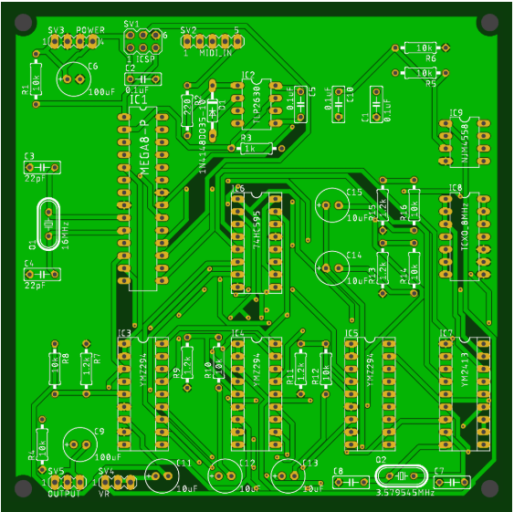
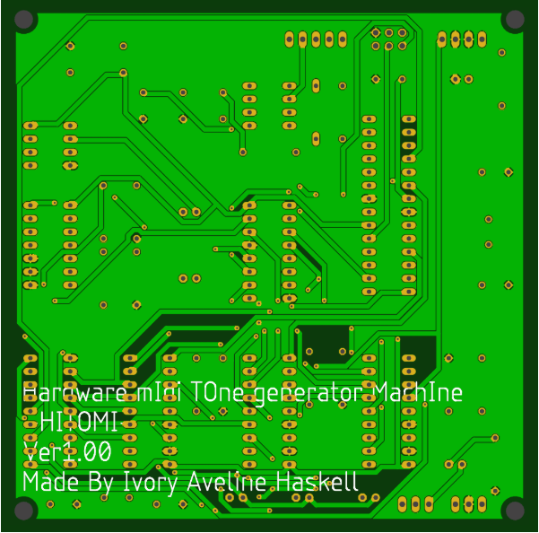
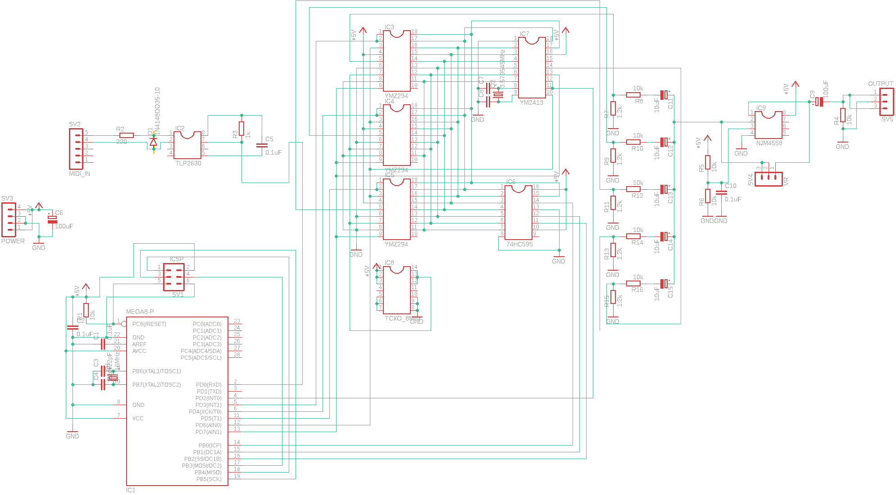

# ハードウェアMIDI音源について

## 名称

**H**ardware m**I**di **TO**ne generator **M**ach**I**ne,通称HITOMI

## 機能

一般的なMIDI音源と同様に振る舞うが、使わないMIDIメッセージに対応はしないこととする。

### 入力端子

DIN5ピン、標準的なMIDI音源と同様である。

### メインMCU

ATMega328pを16MHzで使用する。

### 音源

PSG音源としてYMZ294 * 3,

FM音源としてYM2413 * 1

### 出力

3.5mmイヤホンジャックによる出力

### 電源

GND=0v

Vcc=5v

## 基板について

サイズ違いは単に解像度の違いなのでご容赦いただきたい。

99x99の基板サイズに全要素を詰め込んだ。

回路図は以下の通り

## ファームウェアについて

まだ作り始めてすらいないため書けません。
