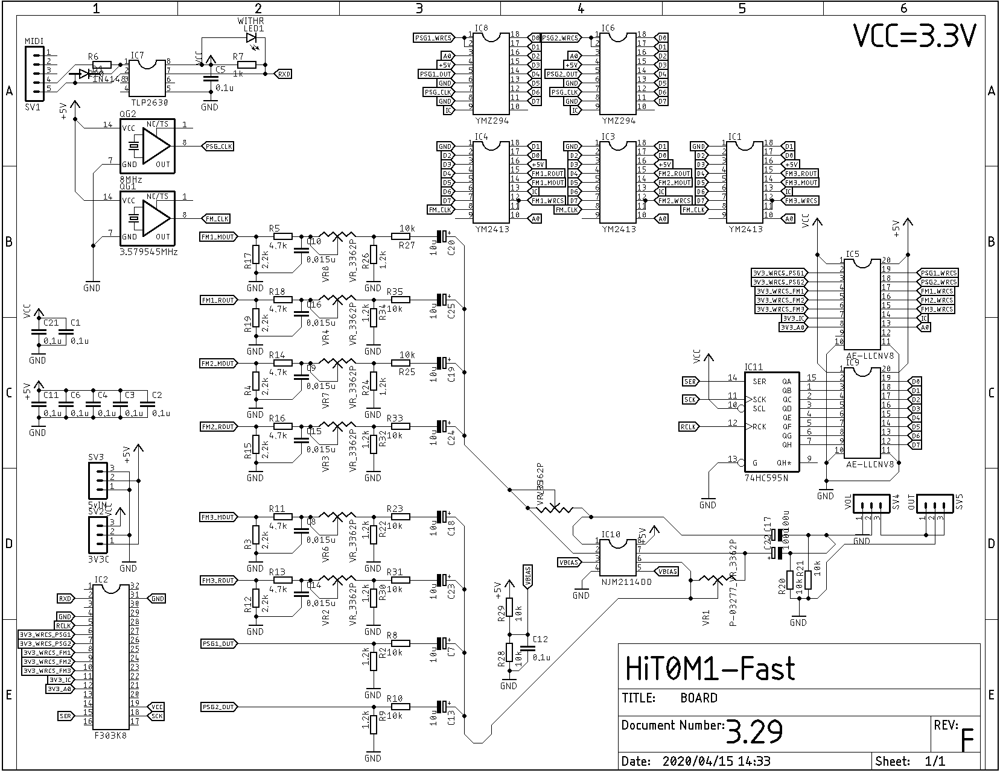
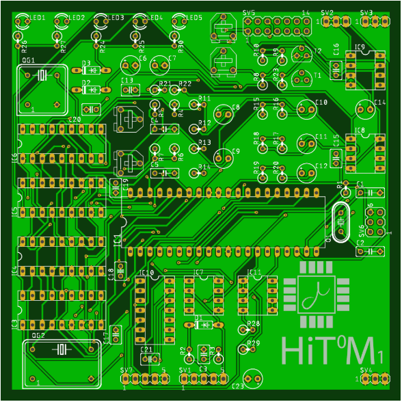
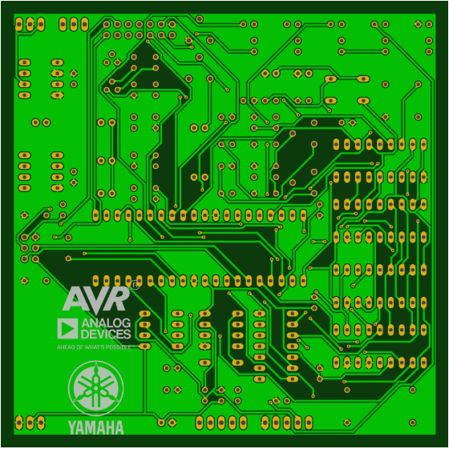
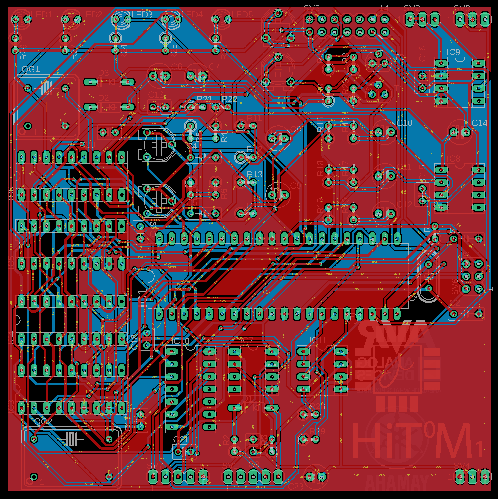

# HiT0M1

## 仕様

メインMCU:**ATMega328p@16MHz**

PSG音源IC:**YMZ294**

FM音源IC:**YM2413**

最大同時発音数:**PSG9和音,FMメロディー6ch,FMリズム5ch**

入力:**MIDI**

I/F:**USB(MIDIと排他利用),MIDI(DIN5Pin),3.5mmステレオジャック(出力はモノラル)**

インジケータ:**LEDx5(電源,MIDI IN,USB Active,USB TX,USB RX)**

基板:**100x100,2層**

## ハードウェアについて

回路図を以下に示す。

### 使用している部品

なお一部の部品は入手が難しい場合がある。

**IC類**

| 名称                                                         | 個数 | 小計 |
| ------------------------------------------------------------ | ---- | ---- |
| [ＡＶＲマイコンＡＴＭＥＧＡ１２８４Ｐ－ＰＵ](http://akizukidenshi.com/catalog/g/gI-04461/) | 1    | 750  |
| [ヤマハ音源ＩＣ（ＹＭＺ２９４）](http://akizukidenshi.com/catalog/g/gI-12141/) | 3    | 900  |
| [YM2413](https://www.chip1stop.com/view/dispDetail/DispDetail?partId=YMHA-0000015&mpn=YM2413) | 1    | 1060 |
| [２回路入ＨｉＦｉオペアンプ　ＮＪＭ２１１４ＤＤ](http://akizukidenshi.com/catalog/g/gI-00068/) | 1    | 100  |
| [プリアンプＩＣ　ＳＳＭ２０１９ＢＮＺ](http://akizukidenshi.com/catalog/g/gI-13301/) | 1    | 440  |
| [ＵＳＢ⇔シリアル変換ＩＣ　ＭＣＰ２２２１Ａ－Ｉ／Ｐ](http://akizukidenshi.com/catalog/g/gI-13069/) | 1    | 210  |
| [フォトカプラ　フォトリレー　ＴＬＰ２６３０Ｆ](http://akizukidenshi.com/catalog/g/gI-08254/) | 1    | 150  |
| [ＤＩＰスイッチ　４Ｐ](http://akizukidenshi.com/catalog/g/gP-00586/) | 1    | 50   |

**抵抗**

| 抵抗値                                                       | 個数 | 小計 |
| ------------------------------------------------------------ | ---- | ---- |
| [カーボン抵抗（炭素皮膜抵抗）　１／４Ｗ２２０Ω　（１００本入）](http://akizukidenshi.com/catalog/g/gR-25221/) | 1    | 100  |
| [カーボン抵抗（炭素皮膜抵抗）　１／４Ｗ６８０Ω　（１００本入）](http://akizukidenshi.com/catalog/g/gR-25681/) | 5    | 100  |
| [カーボン抵抗（炭素皮膜抵抗）　１／４Ｗ１．２ｋΩ　（１００本入）](http://akizukidenshi.com/catalog/g/gR-25122/) | 5    | 100  |
| [カーボン抵抗（炭素皮膜抵抗）　１／４Ｗ２．２ｋΩ　（１００本入）](http://akizukidenshi.com/catalog/g/gR-25222/) | 3    | 100  |
| [カーボン抵抗（炭素皮膜抵抗）　１／４Ｗ１０ｋΩ　（１００本入）](http://akizukidenshi.com/catalog/g/gR-25103/) | 14   | 100  |
| [半固定ボリューム　１０ｋΩ　［１０３］](http://akizukidenshi.com/catalog/g/gP-06063/) | 4    | 80   |

**コンデンサ**

| 容量                                                         | 個数 | 小計 |
| ------------------------------------------------------------ | ---- | ---- |
| [セラミックコンデンサー　２２ｐＦ２ｋＶ](http://akizukidenshi.com/catalog/g/gP-11548/) | 2    | 20   |
| [絶縁ラジアルリード型積層セラミックコンデンサー　０．１μＦ５０Ｖ２．５４ｍｍ　（１０個入）](http://akizukidenshi.com/catalog/g/gP-00090/) | 9    | 100  |
| [フィルムコンデンサー　０．０１５μＦ５０Ｖ　ルビコンＦ２Ｄ](http://akizukidenshi.com/catalog/g/gP-15048/) | 2    | 20   |
| [オーディオ用電解コンデンサー１０μＦ５０Ｖ８５℃　ニチコンＦＧ](http://akizukidenshi.com/catalog/g/gP-04621/) | 5    | 50   |
| [オーディオ用電解コンデンサー１００μＦ２５Ｖ８５℃　ニチコンＦＧ](http://akizukidenshi.com/catalog/g/gP-05041/) | 1    | 20   |
| [電源用電解コンデンサー４７０μＦ３５Ｖ１０５℃　ルビコンＺＬＨ](http://akizukidenshi.com/catalog/g/gP-02719/) | 1    | 40   |

**クリスタル**

| 名称                                                         | 個数 | 小計 |
| ------------------------------------------------------------ | ---- | ---- |
| [クリスタル（水晶発振子）　１６ＭＨｚ](http://akizukidenshi.com/catalog/g/gP-08671/) | 1    | 30   |
| [クリスタルオシレータ　８ＭＨｚ（長方形）](http://akizukidenshi.com/catalog/g/gP-01566/) | 1    | 100  |
| [クリスタルオシレータ　３．５７９５４５ＭＨｚ（正方形）](http://akizukidenshi.com/catalog/g/gP-01153/) | 1    | 150  |

その他

| 名称                                                         | 個数 | 小計 |
| ------------------------------------------------------------ | ---- | ---- |
| [３ｍｍ赤色ＬＥＤ　７０°　ＯＳＲ５ＪＡ３Ｚ７４Ａ](http://akizukidenshi.com/catalog/g/gI-11577/) | 5    | 50   |
| [ＤＩＮソケット（メス）　５Ｐ　１８０°　ＭＪ－１９２](http://akizukidenshi.com/catalog/g/gC-10456/) | 1    | 60   |
| [２．１ｍｍ標準ＤＣジャック　パネル取付用　ＭＪ－４０](http://akizukidenshi.com/catalog/g/gC-08629/) | 1    | 85   |
| [超小型スイッチングＡＣアダプター５Ｖ１Ａ　ＡＤ－Ｄ５０Ｐ１００](http://akizukidenshi.com/catalog/g/gM-06096/) | 1    | 600  |
| [小型ボリューム　１０ＫΩＡ（１６Ｋ４）](http://akizukidenshi.com/catalog/g/gP-00242/) | 1    | 40   |
| [汎用小信号高速スイッチング・ダイオード　１Ｎ４１４８　１００Ｖ２００ｍＡ（５０本入）](http://akizukidenshi.com/catalog/g/gI-00941/) | 3    | 100  |
| [トランジスタ　２ＳＡ１０１５ＧＲ　５０Ｖ１５０ｍＡ　（１０個入）](http://akizukidenshi.com/catalog/g/gI-00882/) | 1    | 100  |
| [トランジスタ　２ＳＤ４６８Ｌ－Ｃ－Ｔ９Ｎ－Ｋ　２０Ｖ１Ａ](http://akizukidenshi.com/catalog/g/gI-10671/) | 1    | 10   |
| [ボックスヘッダ　６Ｐ（２×３）](http://akizukidenshi.com/catalog/g/gC-13175/) | 1    | 15   |
| [ＵＳＢｍｉｃｒｏＢコネクターパネル取付キット](http://akizukidenshi.com/catalog/g/gK-13272/) | 1    | 250  |
| [丸ピンＩＣソケット　（　８Ｐ）](http://akizukidenshi.com/catalog/g/gP-00035/) [丸ピンＩＣソケット　（１８Ｐ）](http://akizukidenshi.com/catalog/g/gP-00030/) [丸ピンＩＣソケット　（４０Ｐ）](http://akizukidenshi.com/catalog/g/gP-00034/) | 各1  | 285  |
| [金属ケース　アルミ製　ＭＢ１２－３－１２](http://akizukidenshi.com/catalog/g/gP-13712/)(オプショナル) | 1    | 750  |
| [基板用ワンタッチスペーサー　両面テープ付](http://akizukidenshi.com/catalog/g/gP-12347/)(オプショナル) | 8    | 160  |
| [３．５ｍｍステレオミニジャックＭＪ－０７４Ｎ　パネル取付用](http://akizukidenshi.com/catalog/g/gC-09630/) | 1    | 65   |
| [３Ｐトグルスイッチ　１回路２接点](http://akizukidenshi.com/catalog/g/gP-03774/) | 1    | 80   |
| [メタルツマミ（ノブ）　Ｋ－２９－６．１　Φ１３．７×１３．５ｍｍ　アルミ削り出し](http://akizukidenshi.com/catalog/g/gP-12202/) | 1    | 310  |
| [ＬＣＤキャラクタディスプレイモジュール（１６×２行バックライト無）](http://akizukidenshi.com/catalog/g/gP-00040/) | 1    | 500  |

**合計:8230円(ケースあり、工具なし)**

ケースなしの場合:7320円

##　工具

| 名称                                                         | 単価 |
| ------------------------------------------------------------ | ---- |
| [ハンドニブラー](https://www.monotaro.com/g/02921286/?monotaroNo=67371553) | 1490 |
| [電気ドリル](https://www.monotaro.com/g/04120647/?monotaroNo=28556344) | 3690 |
| [ストレートドリルセット TiNコート](https://www.monotaro.com/g/02896015/?monotaroNo=68712053) | 1790 |
| [テーパリーマ](https://www.monotaro.com/g/00273574/?monotaroNo=35522094) | 899  |
| [ダイヤモンドヤスリ 小細工用 セット](https://www.monotaro.com/g/00017064/?monotaroNo=6727725) | 1190 |

**工具分合計:9059円**

**フルセットで揃えた場合:17289円**